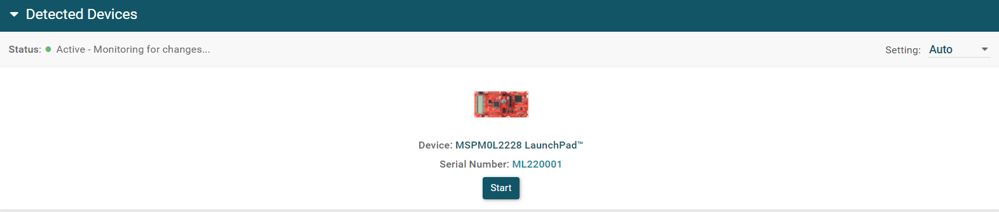
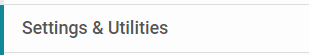
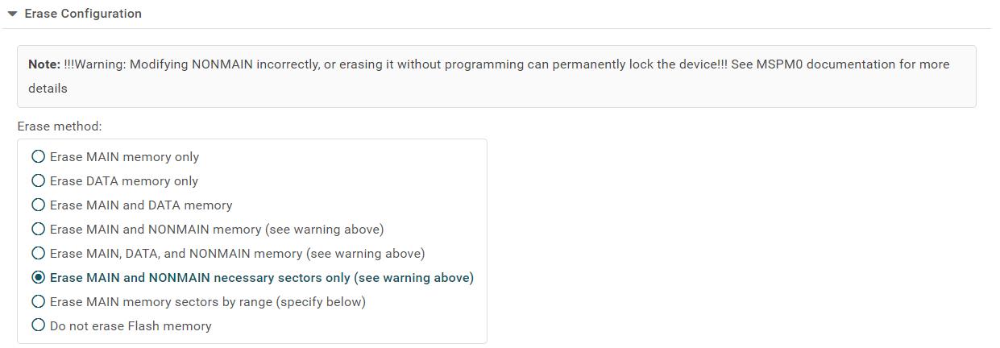
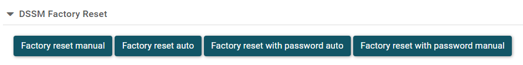
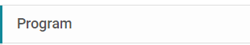
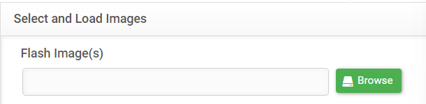
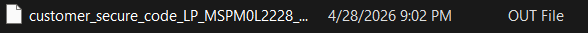
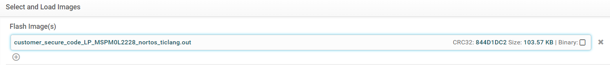
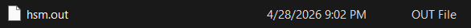

# Vault HSM — CSC + LCD branch

How to flash and run this on the dev board.

## Setup

1. Download this branch as a ZIP and extract.
2. Install UniFlash from <https://www.ti.com/tool/UNIFLASH> if you don't have it.
3. Plug the LP-MSPM0L2228 dev board into your computer.
4. Open UniFlash. It should auto-detect the board:

Click **Start**.

## Factory Reset (first time only)

Go to **Settings & Utilities**:

Set Erase method to **Erase MAIN and NONMAIN sectors only**:

Press **Factory reset auto**:

Close UniFlash, unplug the board, then reconnect it and reopen UniFlash. Go back to Settings & Utilities and switch the erase method to **Erase MAIN and NONMAIN necessary sectors only**.

## Build

In CCS, build both projects:
- `customer_secure_code_LP_MSPM0L2228_nortos_ticlang/`
- `hsm/`

## Flash

Go to the **Program** tab:

Click **Browse** under Flash Image(s):

Navigate to `hsm-main\customer_secure_code_LP_MSPM0L2228_nortos_ticlang\Debug\` and double-click the `.out` file:

It'll appear in the list:

Press the **(+)** to add another image. Navigate to `hsm-main\hsm\Debug\` and double-click `hsm.out`:

Click **Load Images**.

## Run

Press the **MSP_NRST** button on the dev board. After a moment, **LED3** should turn on for ~1 second and off for ~1 second in a steady heartbeat.

## LCD (optional)

To enable the LCD display, in CCS right-click the `hsm` project → Properties → Build → Tools → Arm Compiler → Predefined Symbols → add `LCD_ENABLE=1`. Rebuild and re-flash. The LCD will show test progression on boot.
