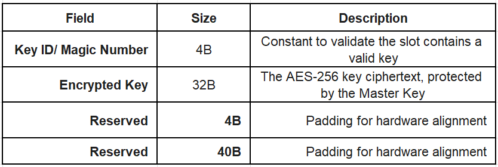

# HSM File Manager (FM) Design - Version: 1.0

The HSM will store 8 blocks distributed across 1 sector of Flash memory (1 KB). The purpose of this document is to outline the architecture of the File Manager module, its dependencies, and the current Flash memory layout.

## Flash Memory Layout

### Blocks Layout
* **Capacity:** 8 slots (128 Bytes each) = 1 Flash sector (1 KB)
* **Atomic Operations:** The MCU handles 128B as the native atomic write operation
* **Slot Structure:** 40 Bytes (Metadata & Crypto) + 88 Bytes (Payload)
* **Sector 1:** 40 Bytes (Metadata & Crypto) + 88 Bytes (Payload)

**Note on Chunk Index:** This field was removed as it is redundant for our sequential model. Its 2 bytes were merged into the `Reserved` field.

### Key Layout
This 1KB sector is reserved exclusively for the Auth key persistence

* **Slot Structure**: 8 available slots (128B each).
* **Implementation**: The Security Block is statically assigned to Slot 0.

Access Control: Restricted to the Auth Engine. Any Router UART request targeting this sector is rejected by the File Manager.

---

## Dependencie 1: UART Protocol

The UART frame structure:

Previous:

| SoF | Message ID | Payload Length | Payload | Checksum |
| --- | --- | --- | --- | --- |
| 2 Bytes | 2 Bytes | 2 Bytes | 0 - 88 Bytes | 2 Bytes |

New:

| SoF | Message ID | Block ID | Payload Length | Payload | Checksum |
| :---: | :---: | :---: | :---: | :---: | :---: |
| 2 Bytes | 2 Bytes | 2 Bytes | 2 Bytes | 0 - 88 Bytes | 2 Bytes |

Alex - If we decide the QR code: We are using a sequential block-storage approach

The File Manager requires these shared fields from the router:

- `Block ID` (prev. File ID): The Host will request blocks sequentially (e.g., Blocks 1 to 8 to reconstruct the QR code)
- `Payload Length`: Max 88 Bytes
- `Payload`: QR code image or JSON credentials

---

## Dependency 2: Crypto Module (AES-GCM)

### 1. Block Encryption (Write Operation)
- **Inputs (Block Manager -> Crypto):**
  - `Plaintext`: Data payload (max 88 Bytes)
  - `AAD`: Block ID + Payload Length
- **Outputs (Crypto -> Block Manager):**
  - `IV / Nonce`: 12 Bytes (newly generated via TRNG per write)
  - `Ciphertext`: 88 Bytes
  - `Auth Tag`: 16 Bytes

### 2. Block Decryption (Read Operation)
* **Inputs (Block Manager -> Crypto):**
  * `Ciphertext`: 88 Bytes.
  * `IV / Nonce`: 12 Bytes.
  * `Auth Tag`: 16 Bytes.
  * `AAD`: Block ID + Payload Length.
* **Outputs (Crypto -> Block Manager):**
  * `Status`: Success (`STATUS_OK`) or Authentication Failure (`ERROR_AUTH_FAILED`).
  * `Plaintext`: 88 Bytes (Provided only if Status is OK).

---

## Dependency 3: Secure Boot & CSC (Customer Secure Configuration)

The CSC acts as the root of trust during the MCU boot sequence. It executes in high-privilege mode before the main application starts. 

The CSC is  responsible for managing the hardware firewalls and the persistence of the Master Key. The CSC bypasses the Block Manager and interacts directly with the `NONMAIN` Flash sector.

### CSC Boot Sequence Flow:

1. Memory firewall initialization: The CSC starts in a privileged state with access to all Flash sectors.
2. Master Key Persistence Check: The CSC checks a specific `NONMAIN` Flash sector to see if a Master Key already exists.
   - First Boot: It triggers the TRNG to generate a 32-Byte key, writes it directly to the `NONMAIN` Flash sector, and loads it into the Keystore.
   - Subsequent Boots: It reads the existing 32-Byte key directly from the `NONMAIN` Flash sector and loads it into the  Keystore.
3. - Hardware Lockdown: The CSC configures the hardware memory protection units (firewalls) to permanently block all read/write access to the `NONMAIN` Master Key sector for the remainder of the power cycle.
4. Handover (INITDONE): The CSC signals `INITDONE`, dropping privileges and handing over execution to the main application.

Note: NONMAIN is a dedicated region of Flash memory physically separated from the MAIN Flash
