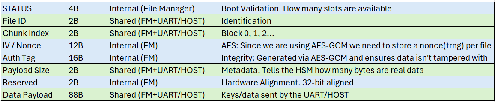

# Requirements - Version: 1.0
HSM Requirements doc.

# PC Module Requirements
## UART Driver
## Client Tool
### Config
- Baud rate:

- Data bits:

- Stop bits:

- Parity:

- Flow control:
### User Interface

## Host Crypto Module
- Encrypt/Decrypt using <> algorithm

# HSM MSPM0L2228

- Update headings per module structure

## Drivers
### UART Driver
- PA10, PA11 pins, UART0 for back channel UART over XDS110.
### Timer Driver
### TRNG Driver
### Key Storage Driver
### CSC
### AESADV Driver
- Execute encryption and decryption using <> algorithm on command.
### Internal Flash Driver

## Modules
### UART CMD Router
- Process UART message (CT CMD).

- 6 digit PIN
- No recovery pin for MVP.
- Utilize delay to prevent brute-force attack.
- Session length = 30(?) minutes.

- Initiate PT/CT commands to Crypto Module.

- Provide file fragments to File Manager.

### Auth Engine
- Pass or reject PIN.

- Utilize hold-off timer from Timer driver.
### State Machine
- Determine state.

- Provide state to File manager.

[Lucid](https://lucid.app/lucidchart/5827d84f-9abe-46e0-980a-d92e260726f6/edit?viewport_loc=-1523%2C-313%2C2175%2C1041%2C0_0&invitationId=inv_95124e0c-bc93-4dda-9296-33a5c928662e)
### Crypto Module
- Utilize TRNG, Key storage, and AES module to encrypt and decrypt provided file.

- Key Manager doc located in ../images/HSM Key Manager.pdf
#### Master Root Key
- Purpose: non-volatile AES key that encrypts other keys used in the system.
- Length: 128/256-bit
- Initial Creation: one-time, during first boot of MSPM0
- Derived from: TRNG
- Location: Keystore, PD0 Bus

#### Session Public Key
- Purpose: ECDH key that encrypts the UART comms to the client
- Length: 128-bit
- Initial Creation: Upon successful ACK of client comms request.
- Derived from: session private key+ EC base point.
- Location: SRAM, PD1 Bus

#### File Storage Keys
- Purpose: AES key tied to a file used to encrypt/decrypt the file
- Length: 128/256-bit
- Initial Creation: Upon write file request from client.
- Derived from: TRNG
- Location: Encrypted via master root key, Flash B0/B1, PD1 bus

#### Session Private Key
- Purpose: ECDH key that decrypts the UART communications from the client.
- Length: 128-bit
- Initial Creation: upon successful ACK of client comms request
- Derived from: TRNG
- Location: SRAM, PD1 Bus

### File Manager
- Check current state and store file in internal flash mem.

### File Manager
- Check current state and store file in internal flash mem.
- Model: 8 slots (128B each) = 1 Flash sector (1KB)
- Atomic: The MCU handles 128B as the native atomic operation
- Slot structure: 40B (metadata) + 88B payload

